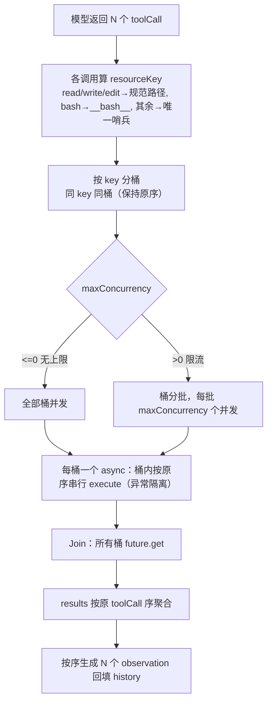

# 工具分发 Fork-Join 重构设计

| 项目 | 内容 |
|---|---|
| 日期 | 2026-07-01 |
| 状态 | 已采纳，待实现 |
| 关联代码 | `core/engine/Engine2StageReAct.{h,cpp}`、`core/engine/EngineReActLoop.cpp`、`core/tool/Tool.{h,cpp}`、`core/tool/ToolManager.{h,cpp}`、`core/tool/{ReadFile,WriteFile,EditFile,Bash}Tool.h`、`core/schema/Settings.{h,cpp}`、`app/EngineThread.cpp`、`app/SettingsDialog.cpp` |
| 关联测试 | `core/tests/test_ToolManager.cpp`、`core/tests/test_Settings.cpp` |

---

## 1. 背景与目标

当前引擎（`Engine2StageReAct` 与 `EngineReActLoop`）执行单轮多个 `toolCall` 时采用**串行 for 循环**逐个同步调用 `ToolManager::execute`。N 个工具的总耗时 = 各工具耗时之和。

**目标**：将工具分发环节重构为 **Fork-Join（分支-聚合）模式**——一轮的 N 个 `toolCall` 并发执行（Fork），全部完成后按原调用顺序聚合结果（Join），回填 observation。**且必须保证同目标资源（同一文件）操作的顺序正确性**——并发不能引入数据竞争。并发度可配置，默认无上限。

**非目标**（YAGNI，本次不做）：
- 不引入线程池基础设施。
- 不改造 `Tool::execute` 签名接入 `CancellationToken`（工具级取消是独立话题）。
- 不改 `Provider::generate`（本就同步阻塞，并发只发生在工具执行段）。

---

## 2. 现状与问题

`Engine2StageReAct::run`（第 72-85 行）与 `EngineReActLoop::run`（第 47-61 行）有**几乎完全相同**的工具分发循环：

```cpp
for (const auto& call : actionResult.message._toolCalls) {
    schema::ToolResult toolResult = _toolManager->execute(call);   // 串行阻塞
    schema::Message observation;
    observation._role = schema::Role::User;
    observation._content = toolResult._output;
    observation._toolCallId = call._id;
    history.push_back(observation);
}
```

两个问题：
1. **串行**：N 工具耗时相加。
2. **重复**：两引擎复制粘贴同一段逻辑（DRY 隐患）。

---

## 3. 设计决策（含决策记录）

| 决策点 | 选定方案 | 备选 | 理由 |
|---|---|---|---|
| 分发器归属 | `ToolManager::executeAll`（两引擎通用） | 独立 `ToolDispatcher` 类 / 引擎内各自实现 | `ToolManager` 已持有工具、负责分发，是并发分发的天然归属；不新增类；消除两处重复（DRY）。原 `execute(call)` 保留，向后兼容。 |
| 线程模型 | `std::async`（`std::launch::async`） | `std::thread` + join / 线程池 | C++17 标准库零基础设施；异常自动封入 `future`；适合"一轮几个工具"的短并发。线程池属过度设计（YAGNI）。 |
| 并发度 | `Settings::_maxToolConcurrency`，`0` = 无上限，默认 `0` | 硬编码 / 固定值 | 用户可按机器/场景调；`0` 语义清晰；默认无上限最简单。 |
| 限流实现 | 桶分批（每批 `maxConcurrency` 个桶） | 信号量持续限流 | KISS；默认无上限时限流分支不走；分批简单可靠。 |
| **同目标资源冲突** | **资源键分桶串行化** | 写全局串行 / 乐观冲突报错 / 拒绝同轮多写 | 见 §4.1，既享受不同文件并发、又保证同文件顺序正确，符合开闭原则。 |
| 注入方式 | `Engine` 基类 `setMaxToolConcurrency` setter | 改构造签名 | 不破坏基类构造签名，向后兼容现有派生与 `skeleton_compile_check`。 |

---

## 4. 详细设计

### 4.1 资源键分桶串行化（并发正确性核心）

**动机**：并发下，两个操作同一文件的工具会各自基于原始内容读写、后写覆盖先写（**lost update**）。例：文件 `ABC`，`edit1(A→X)` 与 `edit2(C→Z)` 并发，两者都基于 `ABC`，最终只得 `XBC` 或 `ABZ`，得不到正确的 `XBZ`。读+写并发则读到版本不确定。

**机制**：工具声明自己调用的"资源键"（`resourceKey`）；`executeAll` 按键分桶——**同键桶内按原序串行 execute、异键桶间并发**。这样同文件操作自然落同桶串行（顺序确定、无 lost update），不同文件全并发，结果仍按原 toolCall 序聚合。

### 4.2 `Tool::resourceKey`（基类新增虚方法）

```cpp
// Tool.h
#include <optional>
class Tool : public schema::PostMessageInterface {
    // ...
    // 该调用锁定的资源键：相同键的调用被串行化执行；nullopt 表示不参与串行化（自由并发）。
    // 默认 nullopt——现有/未来不操作共享资源的工具无需 override。
    virtual std::optional<std::string> resourceKey(const schema::ToolCall& call) const {
        return std::nullopt;
    }
};
```

### 4.3 各工具 override

**文件类（`ReadFileTool`/`WriteFileTool`/`EditFileTool`）**——返回参数 `path` 规范化后的工作区内绝对路径：

```cpp
std::optional<std::string> resourceKey(const schema::ToolCall& call) const override {
    const auto args = call.parseArguments();
    if (!args.is_object() || !args.contains("path") || !args["path"].is_string())
        return std::nullopt;                 // 参数不全（execute 会报错），不约束
    const std::string relPath = args["path"].get<std::string>();
    const fs::path base = resolveWorkBase();
    if (base.empty()) return std::nullopt;
    auto hit = resolveInsideForWrite(base, relPath);   // 穿越检查 + 规范化，不查存在性（key 仅用于分桶）
    return hit ? std::optional<std::string>(hit->string()) : std::nullopt;  // 越界→execute 报错，不约束
}
```

> 复用 `resolveInsideForWrite` 的路径规范化（含 PathCodec 编码候选）：同一文件的不同写法（编码差异）规范化到同一绝对路径 → 同键 → 同桶串行。读与写同 path 也得到同键（保证读到一致版本）。

**`BashTool`**——返回固定全局键：

```cpp
std::optional<std::string> resourceKey(const schema::ToolCall&) const override {
    return "__bash__";    // 所有 bash 归一桶串行（避免命令互相干扰）；与文件桶并发（乐观）
}
```

> bash 的目标文件无法从 `command` 静态推断，故不归并到任何文件桶。`__bash__` 使多个 bash 串行；bash 与文件操作并发属乐观假设（多数 bash 跑测试/编译/git 不改工作区源文件）——此风险见 §10，未来可用"全局互斥键"收紧。

### 4.4 `ToolManager::executeAll`（Fork-Join 分桶调度）

```cpp
// ToolManager.h
#include <future>
// 按 maxConcurrency 并发执行 calls：同 resourceKey 的调用串行、异 key 并发；
// 结果按 calls 原序返回。maxConcurrency<=0 表示无上限。任何工具抛异常都被隔离为 isError。
std::vector<schema::ToolResult> executeAll(const std::vector<schema::ToolCall>& calls,
                                           int maxConcurrency);
```

```cpp
std::vector<schema::ToolResult> ToolManager::executeAll(
    const std::vector<schema::ToolCall>& calls, int maxConcurrency) {
    const size_t n = calls.size();
    std::vector<schema::ToolResult> results(n);
    if (n == 0) return results;

    // 1) 分桶：key → 原索引列表（保持原序）。无工具/无 key 的用唯一哨兵桶（自由并发）
    std::map<std::string, std::vector<size_t>> buckets;
    for (size_t i = 0; i < n; ++i) {
        Tool* tool = getTool(calls[i]._name);
        std::optional<std::string> key = tool ? tool->resourceKey(calls[i]) : std::nullopt;
        std::string bk = key.value_or("__free_" + std::to_string(i) + "__");
        buckets[bk].push_back(i);
    }

    // 2) 异常隔离：子线程 execute 万一抛 C++ 异常，转为 isError，绝不炸进程
    auto runOne = [this](const schema::ToolCall& c) -> schema::ToolResult {
        try { return this->execute(c); }
        catch (const std::exception& e) {
            schema::ToolResult r; r._toolCallId = c._id;
            r._isError = true; r._output = std::string("工具执行异常: ") + e.what();
            return r;
        } catch (...) {
            schema::ToolResult r; r._toolCallId = c._id;
            r._isError = true; r._output = "工具执行异常: 未知错误";
            return r;
        }
    };

    // 3) 每桶一个 async，桶内按原序串行 execute；桶间并发
    auto runBucket = [&](const std::vector<size_t>& idxs) {
        for (size_t idx : idxs) results[idx] = runOne(calls[idx]);   // 同桶串行，按原序填 results
    };
    std::vector<std::pair<std::string, std::vector<size_t>>> bucketList(buckets.begin(), buckets.end());

    auto launchBatch = [&](size_t begin, size_t end) {
        std::vector<std::future<void>> fs;
        for (size_t b = begin; b < end; ++b)
            fs.push_back(std::async(std::launch::async, runBucket, std::cref(bucketList[b].second)));
        for (auto& f : fs) f.get();
    };

    if (maxConcurrency <= 0) {
        launchBatch(0, bucketList.size());                 // 无上限：全部桶并发
    } else {
        for (size_t b = 0; b < bucketList.size(); b += maxConcurrency)   // 限流：桶分批
            launchBatch(b, std::min(b + maxConcurrency, bucketList.size()));
    }
    return results;
}
```

**为什么 `maxConcurrency` 限桶数 = 限 execute 并发数**：每桶任一时刻只跑 1 个 `execute`（桶内串行），故同时活跃桶数 = 同时执行的 `execute` 数。

### 4.5 `Settings` 新增字段

```cpp
// Settings.h
int _maxToolConcurrency = 0;   // 工具并发上限，0 = 无上限
```

- `to_json`：`j["maxToolConcurrency"] = s._maxToolConcurrency;`
- `from_json`：`s._maxToolConcurrency = j.value("maxToolConcurrency", 0);`

### 4.6 `Engine` 基类注入

```cpp
// Engine.h
public:
    void setMaxToolConcurrency(int n) { _maxToolConcurrency = n; }
protected:
    int _maxToolConcurrency = 0;   // 0 = 无上限
```

不改构造签名。

### 4.7 引擎分发循环改造

`Engine2StageReAct::run` 第 71-85 行（与 `EngineReActLoop::run` 第 46-61 行相同）替换为：

```cpp
info("模型请求调用 " + std::to_string(actionResult.message._toolCalls.size())
     + " 个工具，并发度=" + (_maxToolConcurrency <= 0 ? std::string("无上限")
        : std::to_string(_maxToolConcurrency)));
std::vector<schema::ToolResult> toolResults =
    _toolManager->executeAll(actionResult.message._toolCalls, _maxToolConcurrency);

for (size_t i = 0; i < actionResult.message._toolCalls.size(); ++i) {
    const auto& call = actionResult.message._toolCalls[i];
    const auto& tr = toolResults[i];
    if (tr._isError) error("  -> 工具[" + call._name + "] 报错: " + tr._output);
    else info("  -> 工具[" + call._name + "] 成功 (返回 "
              + std::to_string(tr._output.size()) + " 字节)");
    schema::Message observation;
    observation._role = schema::Role::User;
    observation._content = tr._output;
    observation._toolCallId = call._id;
    history.push_back(observation);
}
```

### 4.8 `EngineThread` 注入

构造引擎后追加：`_engine->setMaxToolConcurrency(_settings._maxToolConcurrency);`

### 4.9 `SettingsDialog` UI

引擎 Tab 新增 `QSpinBox`（label「工具并发上限（0=无上限）」，范围 `0..32`，默认 `0`），`setSettings` 回显、`getSettings` 收集。

---

## 5. 数据流



---

## 6. 并发保证

| 保证 | 实现方式 |
|---|---|
| **同文件顺序正确（防 lost update）** | 文件类工具 `resourceKey` 返回规范绝对路径 → 同文件调用落同桶 → 桶内串行 execute。读读到一致版本、写不丢更新，结果与串行执行一致。 |
| **全局顺序** | `results[i]` 严格对应 `calls[i]`；observation 按原序生成。满足 OpenAI/Claude 对 tool 结果与 `tool_calls` 顺序/ID 对应的要求。 |
| **错误隔离** | 某工具 `_isError` 不影响其他——全部执行，各自结果独立回填。符合"每个 tool_call 必须有 result"的 API 语义。 |
| **异常隔离** | `runOne` 内 `try/catch(...)` 把子线程 C++ 异常转为 `isError` 结果，避免经 `future::get` 重抛炸掉引擎线程（UB/segfault 仍无法 catch，但 C++ 异常可隔离）。 |
| **线程安全前提**（已核实） | (1) `Tool::execute` 无可变实例状态（`_workDir`/`_definition`/`_postMessage` 均只读）；(2) `ReadFile`/`WriteFile`/`EditFile` 纯 IO、`Bash` 每次起新进程；(3) `PostMessage` 经 `QPostMessage` 的 Qt 信号 `QueuedConnection` 跨线程投递，`Level` 已 `qRegisterMetaType`，多线程 `post` 安全。 |

---

## 7. 日志时序变化

原串行循环逐个打"执行前/结果"。并发后改为：Fork 前 `info("...并发执行 N 个工具，并发度=…")`，Join 后按序打每个结果。日志不再严格成对，但结果汇总按序、信息无损。

---

## 8. 改动清单

| 层 | 文件 | 改动 |
|---|---|---|
| Schema | `core/schema/Settings.{h,cpp}` | 新增 `_maxToolConcurrency`（0=无上限）；ADL 序列化（`value()` 容错默认 0） |
| Tool | `core/tool/Tool.h` | 基类新增虚方法 `resourceKey(call)`（默认 `nullopt`） |
| Tool | `core/tool/{ReadFile,WriteFile,EditFile}Tool.h` | override `resourceKey`：返回 `path` 规范化的工作区内绝对路径 |
| Tool | `core/tool/BashTool.h`（或 WinBashTool 等） | override `resourceKey`：返回 `"__bash__"` |
| Tool | `core/tool/ToolManager.{h,cpp}` | 新增 `executeAll`（分桶 Fork-Join + 异常隔离）；include `<future>`/`<map>` |
| Engine | `core/engine/Engine.h` | 基类加 `_maxToolConcurrency` + `setMaxToolConcurrency` |
| Engine | `core/engine/Engine2StageReAct.cpp` | for 循环 → `executeAll` + 按序回填 |
| Engine | `core/engine/EngineReActLoop.cpp` | 同上（共用 `executeAll`，DRY） |
| App | `app/EngineThread.cpp` | 构造引擎后 `setMaxToolConcurrency(_settings._maxToolConcurrency)` |
| App | `app/SettingsDialog.{h,cpp}` | 引擎 Tab 加 `QSpinBox` + 收集/回显 |
| Test | `core/tests/test_ToolManager.cpp` | `executeAll` 用例（见 §9） |
| Test | `core/tests/test_Settings.cpp` | `_maxToolConcurrency` 序列化用例 |

---

## 9. 测试计划

### 9.1 `test_ToolManager.cpp` 新增

- **顺序保证**：N 个不同 mock 工具，`results[i]._toolCallId == calls[i]._id`、输出对应。
- **跨文件并发加速**：3 个操作**不同**文件、各自 sleep 100ms 的 mock 工具，`maxConcurrency=0`，总耗时 < 250ms（串行 ≈300ms）。
- **同文件串行（lost update 防护）**：注册一个计数 mock 工具，对其同 path 发起 3 次调用（每次读计数→+1→写回）；并发执行后计数应 == 3（若并发竞争会丢失更新，得 <3）。同时用 atomic 计数器断言该 key 桶**峰值并发为 1**。
- **bash 桶串行**：多个 bash 调用（mock），断言 `__bash__` 桶峰值并发为 1。
- **限流**：`maxConcurrency=2`、5 个不同 key 调用，断言同时活跃桶数峰值 ≤ 2。
- **异常隔离**：注入会 `throw` 的 mock 工具，断言进程不崩、对应 `results[i]._isError`、其他正常。
- **错误独立**：一个 `_isError`，其他仍执行回填。
- **空调用**：`calls.empty()` 返回空 vector。

### 9.2 `test_Settings.cpp` 新增

`_maxToolConcurrency` 默认 0；round-trip（4 → 存 → 读 == 4）；缺字段容错为 0。

### 9.3 回归

现有 `test_Engine2StageReAct` / `test_EngineReActLoop`（MockProvider 驱动）继续通过——单工具调用行为不变。

---

## 10. 风险与缓解

| 风险 | 缓解 |
|---|---|
| **bash 与文件操作并发冲突**（bash 改某文件 + 同轮 edit 该文件） | 默认乐观（`__bash__` 与文件桶并发）。多数 bash 不碰工作区源文件。文档/`create-tool` skill 提示此假设；若需收紧，未来加"全局互斥键"让 bash 与所有文件桶互斥（见 §11）。 |
| 工具实现有线程安全漏洞（未来新增工具带可变状态） | `create-tool` skill 补充约定：`execute` 必须无可变实例状态（纯函数式）；需串行化的工具须 override `resourceKey`。 |
| `std::async` 在 MSVC 每任务起一个系统线程 | 一轮 toolCall 通常 1~5 个，桶数更少，无问题；高频场景再上线程池（YAGNI）。 |
| 并发下日志交错难读 | Fork 前打并发度、Join 后按序汇总结果。 |
| UB（segfault）无法被 `catch(...)` 隔离 | 现有工具无 UB 路径；异常隔离覆盖 C++ 异常。UB 隔离需子进程方案，超出范围。 |

---

## 11. 未来扩展（不在本次范围）

- **全局互斥键**：若 bash 与文件并发的乐观假设不成立，引入一种"与所有键互斥"的特殊键，让 bash 独占执行。
- **持续限流**：分批的批间空等若成瓶颈，改 `std::counting_semaphore`（C++20）或手写条件变量信号量。
- **工具级取消**：`Tool::execute` 接入 `CancellationToken`，Fork 时为每任务传 token，Join 时响应取消。
- **线程池**：高频调用场景替代 `std::async`。
